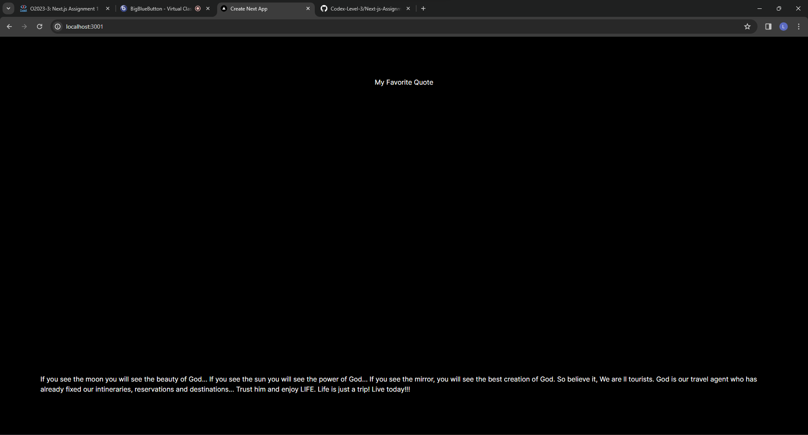
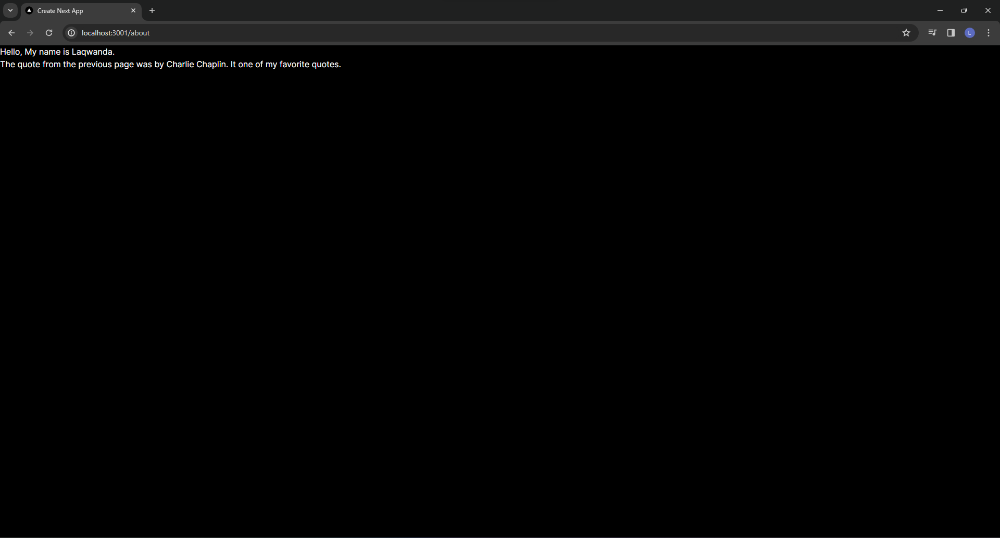

# Next.js Assignment 1

## Objective

The aim of this assignment is to familiarize you with the Next.js framework by creating a simple project. You'll learn to set up a new Next.js application, explore its file structure, and create a basic page. This introduction will help you understand how Next.js combines the power of React with additional features like server-side rendering and static site generation.

This is a [Next.js](https://nextjs.org/) project bootstrapped with [`create-next-app`](https://github.com/vercel/next.js/tree/canary/packages/create-next-app).

## Fav-Quote

This project contains two pages: home and about. The home page displays one of my favorite quotes. The about page displays a simple greeting and message.

### Setting Up Next.js Project

To create the application, I open git bash terminal from my project folder. Then, I ran the command `npx create-next-app@latest fav-quote`. After, selected the settings for the project.
Next, I navigated to project directory with the command `cd fav-quote` and used `code .` to open project in VS Code.

### Creating Pages

#### Modifying Home Page

- Navigated to `src/app/page.js` and replaced existing content with my favorite quote.

#### Adding a New Page

- In the app directory, I created a folder named about.
- In the about folder, I created a file named page.js. In that file, I created a function that return a simple greeting and message.

#### Results

Home  
  
About  


## Getting Started

First, run the development server:

```bash
npm run dev
# or
yarn dev
# or
pnpm dev
# or
bun dev
```

Open [http://localhost:3000](http://localhost:3000) with your browser to see the result.

You can start editing the page by modifying `app/page.js`. The page auto-updates as you edit the file.

This project uses [`next/font`](https://nextjs.org/docs/basic-features/font-optimization) to automatically optimize and load Inter, a custom Google Font.
